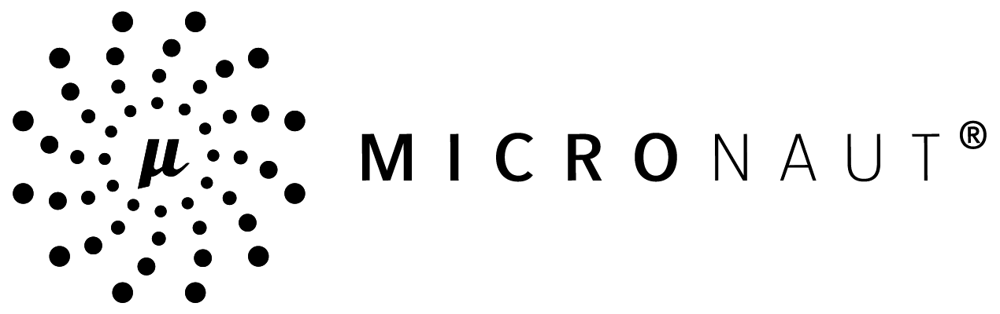
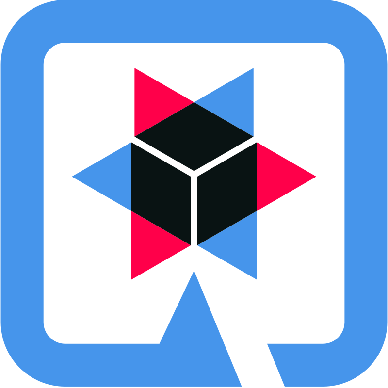
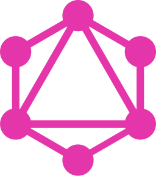
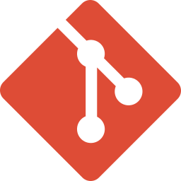

# 👋 Привет, я Виктория backend разработчик java

## 🛠️ Технологии и навыки

**Java, Spring Boot, Java SE, Java Core, JUnit, Maven/Gradle, PostgreSQL, ArangoDB, Docker, Apache Kafka, Kubernetes,
Camunda, Micronaut, Quarkus, GraphQL, AWS S3, система контроля версий GIT, Jira, Oracle SOA Suite 11g/12c, Oracle
Service Bus 12c**

  <!-- Java -->
  
  <!-- Spring Framework -->
  
  <!-- Micronaut -->
  
   
  
  <!-- Quarkus -->
  
  <!-- Apache Maven -->
  
  <!-- Gradle -->
  
  <!-- PostgreSQL -->
  
  <!-- ArangoDB -->
  
  <!-- Docker -->
  
  <!-- Kubernetes -->
  
  <!-- Apache Kafka -->
  
   
  
  <!-- Camunda -->
  
  <!-- GraphQL -->
  
  <!-- AWS S3 -->
  
  <!-- Oracle SOA Suite -->
  
  <!-- Git -->
  
  <!-- Jira -->
  

 

## 💻 Проекты

- [envs_XML](https://gitlab.com/rt_task/envs_xml.git) — Скрипт для парсинга конфигурационных файлов
- [project_tracking](https://gitlab.com/rt_task/example/-/blob/main/project_tracking/README.md?ref_type=heads) —
  Тестовое задание на реализацию микросервиса
- [task-manager-tsk](https://gitlab.com/jse_pavlova) — Учебный проект в рамках курса «ТСК JAVASPRING» разработка
  клиент-серверного приложения.
- [otus-web-app](https://github.com/vpavlovaGIT/otus-web-app) — Проектная работа по теме "Веб-сервер" в рамках курса от
  «OTUS»

## 📫 Контакты

 <a href="https://www.github.com/vpavlovaGIT" target="_blank" rel="noreferrer"> <picture> <source media="(prefers-color-scheme: dark)" srcset="https://raw.githubusercontent.com/danielcranney/readme-generator/main/public/icons/socials/github-dark.svg" /> <source media="(prefers-color-scheme: light)" srcset="https://raw.githubusercontent.com/danielcranney/readme-generator/main/public/icons/socials/github.svg" />  </picture> </a> <a href="https://www.gitlab.com/vpavlova" target="_blank" rel="noreferrer"> <picture> <source media="(prefers-color-scheme: dark)" srcset="undefined" /> <source media="(prefers-color-scheme: light)" srcset="https://raw.githubusercontent.com/danielcranney/readme-generator/main/public/icons/socials/gitlab.svg" />  </picture> </a>

- Email: vikkkapaw@mail.ru
- Telegram: [@vikkkapaw](https://t.me/vikkkapaw)

  